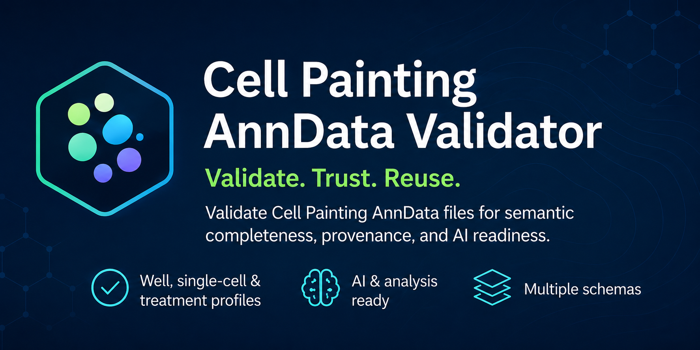

# Cell Painting AnnData Validator

**Validate the semantic correctness, metadata completeness, provenance and basic
AI readiness of Cell Painting datasets stored as
[AnnData](https://anndata.readthedocs.io/) (`.h5ad`) objects.**

[Documentation](https://ronfinn.github.io/cell-painting-anndata-validator/) ·
[Quickstart](https://ronfinn.github.io/cell-painting-anndata-validator/getting-started/quickstart/) ·
[CLI](https://ronfinn.github.io/cell-painting-anndata-validator/reference/cli/) ·
[Python API](https://ronfinn.github.io/cell-painting-anndata-validator/reference/python-api/) ·
[Report a bug](https://github.com/ronfinn/cell-painting-anndata-validator/issues/new/choose) ·
[Discussions](https://github.com/ronfinn/cell-painting-anndata-validator/discussions)

[](https://github.com/ronfinn/cell-painting-anndata-validator/actions/workflows/ci.yml)
[](https://github.com/ronfinn/cell-painting-anndata-validator/actions/workflows/docs.yml)
[](https://www.python.org/)
[](LICENSE)
[](CHANGELOG.md)

<p align="center">
  
</p>

> [!IMPORTANT]
> **Beta (`0.2.0b1`).** The built-in `generic-cell-painting` and `jump-cp`
> schemas are at version **`0.2.1`**. Rule codes and the public `validate()`
> interface are intended to remain stable within this beta line, while schema
> aliases may still be calibrated from public evidence before the final
> `0.2.0` release.

## Current capabilities

- Validate existing `.h5ad` files using dense or sparse matrices
- Validate in-memory or backed AnnData objects
- Detect or explicitly declare `single-cell`, `well` or `treatment` profiles
- Resolve metadata through versioned YAML schemas and ordered aliases
- Report structured findings with stable rule codes and suggested remediation
- Check identifiers, controls, feature naming, metadata and provenance
- Generate console, JSON and self-contained HTML reports
- Use the validator through the `cp-validate` CLI or Python API

## Scope and boundaries

| In scope | Out of scope |
|---|---|
| Structural validity of AnnData slots | Converting CellProfiler, DeepProfiler or CSV output into AnnData |
| Semantic completeness against a schema | Mutating, repairing or rewriting the input file |
| Identifier and profile-level consistency | Automatically normalising or aggregating profiles |
| Basic sampled AI-readiness signals | Assessing the biological significance of a phenotype |
| Presence of licence and provenance metadata | Confirming that provenance claims are scientifically correct |
| Generic and JUMP-oriented compatibility schemas | Defining an official JUMP-endorsed AnnData standard |

The `jump-cp` schema is a **compatibility preset** based on publicly documented
JUMP metadata conventions. It is not an official JUMP AnnData standard.

## Installation

From a local clone (recommended while beta):

```bash
git clone https://github.com/ronfinn/cell-painting-anndata-validator.git
cd cell-painting-anndata-validator
uv sync
uv run cp-validate --version
```

From a local wheel:

```bash
uv build
uv pip install dist/cp_anndata_validator-*.whl
cp-validate --version
```

## CLI example

```bash
uv run python examples/generate_examples.py
uv run cp-validate examples/valid_well_level.h5ad
uv run cp-validate examples/valid_well_level.h5ad --schema jump-cp --profile-level well
uv run cp-validate examples/valid_well_level.h5ad --report report.json
```

## Python example

```python
from cp_anndata_validator import validate

report = validate("examples/valid_well_level.h5ad")
print(report.status)
for issue in report.issues:
    print(issue.code, issue.severity.value, issue.message)
```

## Schemas (summary)

| Schema | Version | Role |
|---|---|---|
| `generic-cell-painting` | `0.2.1` | Vendor-neutral Cell Painting expectations |
| `jump-cp` | `0.2.1` | JUMP-oriented alias compatibility preset |

Custom schema YAML files are supported via `--schema path/to/schema.yaml`.
Unknown schema keys are rejected. See the
[schemas documentation](https://ronfinn.github.io/cell-painting-anndata-validator/schemas/).

## Normal vs strict

| Mode | Warnings fail? | Typical use |
|---|---|---|
| Normal (default) | No | Exploration; bare pipeline exports |
| `--strict` / `strict=True` | Yes | Publishing CI; governance enforcement |

Exit codes: `0` pass, `1` validation failures, `2` could not execute.

## Public-data evidence

Real Cell Painting Gallery well-level profiles were validated outside this
repository (binaries not committed):

- **LINCS** (`cpg0004-lincs`, plate `SQ00014812`, 384 × 493) under
  `generic-cell-painting`
- **JUMP pilot** (`cpg0000-jump-pilot`, plate `BR00116991`, 384 × 838) under
  `jump-cp`

Both passed normal validation (exit `0`), failed under `--strict` on expected
governance warnings only, and matched in-memory / `--backed` behaviour. Details:
[Public-data pilots](https://ronfinn.github.io/cell-painting-anndata-validator/pilots/).

## Documentation

| Topic | Link |
|---|---|
| Full docs site | https://ronfinn.github.io/cell-painting-anndata-validator/ |
| Installation & quickstart | [Getting started](https://ronfinn.github.io/cell-painting-anndata-validator/getting-started/) |
| Rule catalogue | [Schemas and checks](https://ronfinn.github.io/cell-painting-anndata-validator/schemas/rule-catalogue/) |
| Limitations | [Known limitations](https://ronfinn.github.io/cell-painting-anndata-validator/project/limitations/) |
| Changelog | [CHANGELOG.md](CHANGELOG.md) |

## Development

```bash
uv sync --all-groups
uv run pytest
uv run ruff check .
uv run ruff format --check .
uv run mypy src
uv run mkdocs build --strict
uv build
bash scripts/smoke_wheel.sh
```

## Contributing, licence, citation

- [Contributing](CONTRIBUTING.md) · [Code of Conduct](CODE_OF_CONDUCT.md) ·
  [Support](SUPPORT.md) · [Security](SECURITY.md)
- Licence: [Apache-2.0](LICENSE)
- Citation: [CITATION.cff](CITATION.cff)
